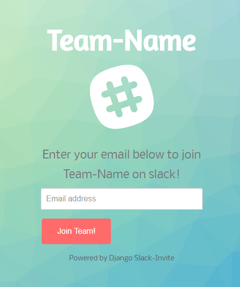

# Django Slack-Invite App
A barebones Django app for automating the invite process for Slack that can easily be deployed to Heroku

This project was inspired by the outsiders JavaScript Slack Invite Automation app.

